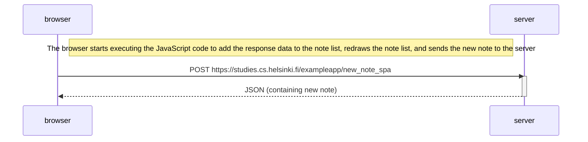

```mermaid
sequenceDiagram
    participant browser
    participant server

    Note right of browser: The browser starts executing the JavaScript code to add the response data to the note list, redraws the note list, and sends the new note to the server

    browser->>server: POST https://studies.cs.helsinki.fi/exampleapp/new_note_spa
    activate server
    server-->>browser: JSON (containing new note)
    deactivate server
```
